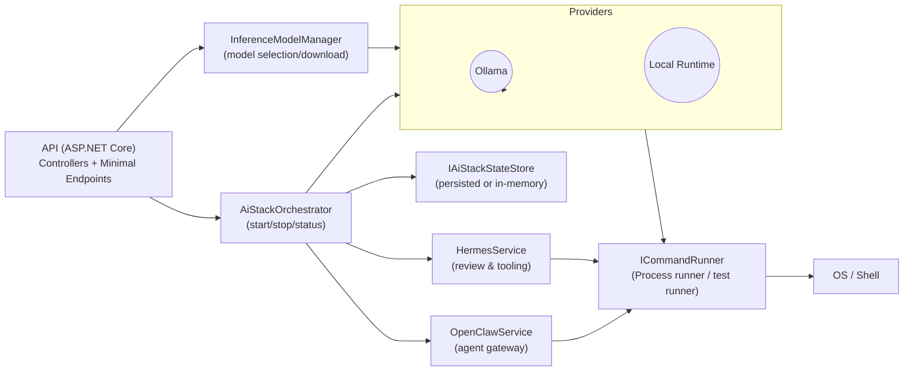

# AiStackManager — One-page Architecture

Key points
- `ICommandRunner` is the single adapter for all shell operations. Tests can override it.
- `IInferenceProvider` is the provider abstraction. Implementations should be side-effect free where possible and expose idempotent `Download/Ensure/Warm` operations.
- `AiStackOrchestrator` coordinates start/stop flows and records state via `IAiStackStateStore`.

Recommended next steps
- Add a durable `IAiStackStateStore` (SQLite/file) for multi-process resilience.
- Publish a provider template with a CONTRIBUTING guide for adding new providers.
